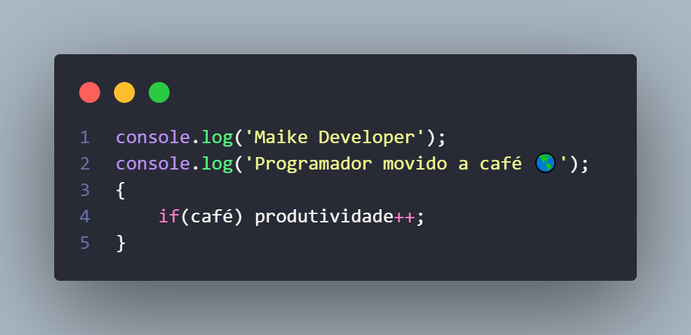

# 👋 Olá, eu sou o **Maike Developer**
🚀 Fundador da **TeamProgramming**, uma comunidade dedicada a conectar e inspirar desenvolvedores.  
🧠 Apaixonado por tecnologia, automação e criação de bots inteligentes.  
💻 Programador movido a café 🌎| if(café) { produtividade++; }

# 🚀 O que eu faço

* 🔥 Fullstack web development (Frontend & Backend)
* 🚀 Criando soluções inteligentes com código limpo e criativo
* 🧠 13+ anos de experiência em desenvolvimento
* 👥 Fundador da TeamProgramming — comunidade de programadores
* 📈 Foco em automação, bots e sistemas eficientes
* 👨‍💻 Engenheiro de software há 2 anos.
* 💻 Programador e Desenvolvedor de Sistemas SAMP (Pawmo)
* 🚧 Criador de TextDrawn/Mapper SAMP

# 🛠️ Tecnologias & Ferramentas

<picture>
  <source media="(prefers-color-scheme: dark)" srcset="https://raw.githubusercontent.com/asmrprog-yt/asmrprog-yt/output/github-snake-dark.svg" />
  <source media="(prefers-color-scheme: light)" srcset="https://raw.githubusercontent.com/asmrprog-yt/asmrprog-yt/output/github-snake.svg" />
  
</picture>

# 💬 Vamos nos conectar

  
  
  <a href="https://mail.google.com/mail/?view=cm&fs=1&to=suportemaikezera@gmail.com">
  
  <a href="https://api.whatsapp.com/send/?phone=5521967371806&text=Olá!%20Vim%20pelo%20seu%20GitHub." target="_blank">
  
  <a href="https://maikedeveloper.netlify.app/" target="_blank">
  

# 📊 Estatísticas

  

 
